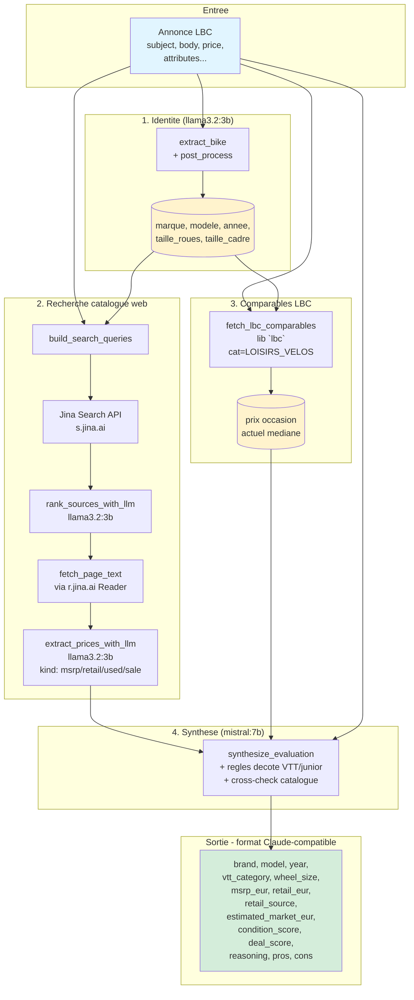

# bike-ia-agent

Agent local d'enrichissement d'annonces velo (Leboncoin) — extraction d'identite, recherche web, comparables LBC, et synthese de marche — sans dependance a une API LLM payante.

Concu comme drop-in replacement du Claude-CLI utilise par [lbc-sniper](../lbc-sniper), avec un meilleur signal de prix marche grace aux comparables LBC en temps reel et la separation **prix catalogue constructeur** / **prix neuf revendeur** / **prix occasion observe**.

## Pipeline de donnees



### Trois prix distincts dans la sortie

| Champ | Signification | Source |
|---|---|---|
| `msrp_eur` | Prix catalogue **constructeur** au lancement (RRP) | Site officiel marque + connaissance LLM |
| `retail_eur` | Prix neuf actuel chez gros **revendeurs** en ligne | Alltricks, Bike-Discount, Probikeshop, Starbike, Bike24... |
| `estimated_market_eur` | Prix **occasion** estime sur LBC | Comparables LBC actuels (signal #1) ou retail × decote (signal #2) |
| `asking_price_eur` | Prix demande dans l'annonce | Champ `price` de l'annonce LBC |

`retail_source` indique le revendeur d'ou est tire `retail_eur` (ex: `"Starbike"`).

## Pre-requis

- Python 3.10+
- [Ollama](https://ollama.com/) avec :
  ```bash
  ollama pull llama3.2:3b   # extraction + ranking + price extraction
  ollama pull mistral:7b    # synthese finale
  ```
- Cle API Jina (gratuite, signup sur [jina.ai](https://jina.ai/)) — 500 RPM, contourne Cloudflare sur les sites constructeur et revendeur.

## Installation

```powershell
python -m venv .venv
.\.venv\Scripts\Activate.ps1
pip install -r requirements.txt
cp .env.example .env       # puis remplir JINA_API_KEY
```

## Usage

### CLI : enrichir une annonce

```powershell
# Search live sur Leboncoin
python .\enrich_bike.py --lbc-search "vtt orbea rallon" --lbc-limit 3 --fetch-pages --output samples\result.json

# Depuis un dict LBC en JSON local
python .\enrich_bike.py --ad-json my-ad.json --domain vtt_enduro --fetch-pages

# Depuis le pack de fixtures (test legacy)
python .\enrich_bike.py --annonce orbea_rise_h10 --fetch-pages --verbose
```

#### Exemples concrets de test

```powershell
# VAE enduro adulte 29" — exerce le pipeline complet (Jina + comparables LBC + synth)
python enrich_bike.py --lbc-search "orbea rise h30" --lbc-limit 1 --fetch-pages --domain vtt_enduro --verbose --output samples/test_orbea.json

# Velo junior 24" — verifie le cross-check wheel_size et la decote junior specifique
python enrich_bike.py --lbc-search "commencal clash 24" --lbc-limit 1 --fetch-pages --domain vtt_enduro --verbose --output samples/clash_24.json
```

Flags utiles :
- `--fetch-pages` : ouvre les pages trouvees pour extraire les prix via Ollama (sinon : signaux extraits du titre/snippet seulement)
- `--verbose` : log toutes les etapes (search, throttle, fetch, rank, synth)
- `--no-lbc-comparables` : skip la recherche d'annonces similaires sur LBC
- `--no-cache` : ignore le cache disque HTTP
- `--raw` : sortie verbeuse `{payload, meta}` au lieu de la forme aplatie
- `--http-timeout` / `--ollama-timeout` / `--synth-timeout` : ajustements perf

### API Python (consommation par lbc-sniper)

```python
from bike_agent import enrich_ad   # ou from enrich_bike import enrich_ad (legacy)

result = enrich_ad(
    ad={
        "id": 123,
        "subject": "VTT Enduro Orbea Rallon M10 2023",
        "body": "...",
        "price": 4500,
        "url": "https://www.leboncoin.fr/...",
        "city": "Bayonne",
        "attributes": {"bicycle_wheel_size": "29\"", ...},
    },
    domain_hint="vtt_enduro",       # depuis classify_vtt() en amont
    extract_model="llama3.2:3b",    # rapide pour identite + tri + extraction prix
    synth_model="mistral:7b",       # plus fort pour l'evaluation
)

# result["payload"] = drop-in pour update_enrichment de lbc-sniper
update_enrichment(db, ad["id"], result["payload"], model="ollama-mistral7b+jina+lbc")
```

### Format de sortie (Claude-compatible)

```json
{
  "ad_id": 123,
  "ad_url": "https://www.leboncoin.fr/...",
  "ad_subject": "VTT Enduro Orbea Rallon M10 2023",
  "asking_price_eur": 4500,
  "duration_s": 175.3,
  "web_search_duration_s": 138.6,
  "brand": "Orbea",
  "model": "Rallon",
  "year": 2023,
  "frame_material": "carbon",
  "wheel_size": "29",
  "electric": false,
  "size_label": "M",
  "vtt_category": "enduro",
  "msrp_eur": 7499,
  "retail_eur": 6299,
  "retail_source": "Bike-Discount",
  "condition_score": 85,
  "estimated_market_eur": 4200,
  "deal_score": 60,
  "reasoning": "...",
  "pros": ["..."],
  "cons": ["..."],
  "_sources": {
    "extracted_identity": {...},
    "msrp_eur_web": 7499,
    "retail_eur_web": 6450,
    "used_eur_web": 4300,
    "msrp_samples": [
      {
        "amount_eur": 7499, "kind": "msrp",
        "source_name": "Constructeur", "source_domain": "orbea.com",
        "url": "https://www.orbea.com/fr-fr/bikes/mountain/rallon",
        "context": "Prix tarif catalogue 2023"
      }
    ],
    "retail_samples": [
      {
        "amount_eur": 6299, "kind": "retail",
        "source_name": "Bike-Discount", "source_domain": "bike-discount.de",
        "url": "https://www.bike-discount.de/fr/orbea-rallon-m10",
        "context": "Prix actuel en stock chez Bike-Discount"
      },
      {
        "amount_eur": 6499, "kind": "retail",
        "source_name": "Alltricks", "source_domain": "alltricks.fr",
        "url": "https://www.alltricks.fr/F-95845-vtt/P-2095822-orbea-rallon-m10",
        "context": "Prix neuf catalogue Alltricks"
      }
    ],
    "lbc_comparables_count": 5,
    "lbc_comparables_median_eur": 4100,
    "lbc_comparables_samples": [...],
    "durations_s": {"extraction_s": 4.2, "web_s": 28.1, "lbc_s": 1.4, "synth_s": 12.3, "total_s": 46.0},
    "models": {"extract": "llama3.2:3b", "synth": "mistral:7b"}
  }
}
```

Les cles `ad_*` apportent la tracabilite. Les cles centrales (`brand` → `cons`) suivent le schema utilise par [lbc-sniper](../lbc-sniper). `_sources` est purement informatif.

## Sources de prix consultees

### Constructeurs (kind=`msrp`, priorite haute)

Catalogue MSRP officiel pour chaque marque connue : Orbea, Trek, Specialized, Cannondale, Canyon, Commencal, Cube, Decathlon, Focus, Giant, Haibike, Kona, KTM, Lapierre, Marin, Mondraker, Norco, Pivot, Propain, Radon, Rocky Mountain, Santa Cruz, Scott, Sunn, Transition, Vitus, Yeti, YT...

### Gros revendeurs en ligne (kind=`retail`, priorite haute)

Prix neuf actuel en boutique : Alltricks, Probikeshop, Bike-Discount, Bike24, Bike-Components, Starbike, Mantel, Bikester, Cyclable, Materiel-Velo, Lecyclo, Wiggle, Chain Reaction Cycles, Tredz, Hibike, Rose Bikes...

### Magazines/comparateurs (kind=`msrp`/`current`, priorite moyenne)

Velo Vert, Big Bike Magazine, 26in, Pinkbike, Bike Magazine, Vital MTB, 99 Spokes, MTB Database, Ekstere.

### Filtres

- URLs Leboncoin filtrees du search web (pas de doublon avec l'annonce source)
- Comparables LBC fetches separement via la lib `lbc` (recherche `marque modele annee` + filtre taille_roues si dispo)

## Structure

```
.
├── enrich_bike.py            # wrapper retrocompat (50 lignes) — re-exports + __main__
├── benchmark_extraction.py   # benchmark d'extraction sur multiples modeles
├── bike_agent/               # package principal de l'agent
│   ├── __init__.py           # API publique (enrich_ad, fetch_lbc_*, ...)
│   ├── config.py             # constantes (USER_AGENTS, RETAILERS, MANUFACTURER_DOMAINS,
│   │                         #             throttle table, cache state, env loader)
│   ├── http_client.py        # http_get, headers (Jina auth), throttle, cache, safe_url
│   ├── search.py             # DDG/Bing/Jina backends + parsers + web_search
│   ├── identity.py           # extract_bike (Ollama), bike_description, junior detection,
│   │                         #   source_profile_for_url (manufacturer/retailer/magazine)
│   ├── pages.py              # fetch_page_text (Jina-first), extract_prices_with_llm
│   ├── ranking.py            # build_search_queries, rank_sources_with_llm
│   ├── synth.py              # SYNTHESIS_SCHEMA, DECOTE_RULES_BIKE, synthesize_evaluation
│   ├── lbc.py                # render_lbc_ad, fetch_lbc_comparables, fetch_lbc_ad
│   ├── pipeline.py           # enrich_identity, summarize_prices, enrich_ad (orchestrateur)
│   └── cli.py                # argparse, main, _output, flatten_result
├── data/                     # fixtures
│   ├── annonces.json
│   ├── catalogue.json
│   └── expected.json
├── samples/                  # sorties d'exemples (gitignored)
└── .cache/                   # cache HTTP disque (gitignored)
```

### Dependances entre modules

```
config         (constantes pures, aucune dep)
  ↑
http_client    (config)
  ↑
search         (config + http_client)
  ↑
identity       (config + http_client + benchmark_extraction)
  ↑
pages          (config + http_client + identity)
  ↑                              ↑
ranking (identity)            synth (pages)        lbc (config)
  ↑                              ↑                   ↑
  └─── pipeline (search + identity + pages + ranking + synth + lbc)
                       ↑
                       cli (config + pipeline + lbc)
                       ↑
                       __init__ (re-exports)
                       ↑
                       enrich_bike.py (legacy wrapper)
```

### Imports

```python
# Recommande (nouvelle API)
from bike_agent import enrich_ad, fetch_lbc_comparables

# Legacy (fonctionne toujours)
from enrich_bike import enrich_ad
```

## Benchmark d'extraction

```powershell
python .\benchmark_extraction.py                       # tous les modeles
python .\benchmark_extraction.py --model mistral:7b    # un seul
python .\benchmark_extraction.py --details             # par-annonce
```

### Resultats actuels (extraction marque/modele/annee/taille/taille_roues sur 23 annonces)

| Modele | Score | Taux | Temps |
|---|---:|---:|---:|
| `gemma3:4b` | 90/115 | 78% | 37.4s |
| `mistral:7b` | 88/115 | 77% | 41.6s |
| `llama3.2:3b` | 85/115 | 74% | 41.0s |
| `qwen2.5:7b` | 81/115 | 70% | 57.7s |

## Choix techniques

- **Jina Reader** (`r.jina.ai/<url>`) pour les fetches de pages : contourne Cloudflare et anti-bot des sites constructeur/revendeur, retourne du markdown propre. Avec cle API : 500 RPM.
- **Jina Search** (`s.jina.ai/?q=`) prioritaire si cle presente. Fallback DDG-via-Jina, puis DDG direct, puis Bing.
- **Cache disque** (`.cache/enrich_bike/`) sur toutes les requetes HTTP : ttl 7j.
- **Throttle par domaine** : DDG 8s, Bing 6s, Jina 0.3s avec cle (3s sans), reste 0.3-0.8s.
- **Backoff exponentiel** sur 403/429 : 30s, 60s, 120s avec jitter.
- **safe_url** : encode automatiquement les espaces/quotes des URLs LBC (cas Commencal `clash 24"/...`).
- **Cross-check LLM** : la synthese mistral:7b corrige l'extracteur llama3.2:3b sur les caracteristiques connues (ex. Orbea Rise H10 = toujours 29", meme si extracteur dit 27.5).
- **Domaine-aware decote** : VTT enduro/DH/AM/junior, regles distinctes selon `vtt_category` et taille de roues.
